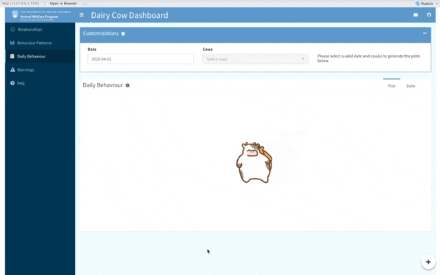

<!-- badges: start -->
[](https://github.com/UBC-AWP/Peek-a-Moo/actions/workflows/deploy.yml) [](https://github.com/UBC-AWP/Peek-a-Moo/actions/workflows/prod-release.yml) [](https://github.com/UBC-AWP/Peek-a-Moo/actions/workflows/update-passwords.yml)
<!-- badges: end -->
# Peek-a-Moo: A dairy cow dashboard for UBC Faculty of Land and Food Systems - Animal Welfare Program

## Welcome :cow: :heart:

Thank you for visiting the Peek-a-Moo app project repository. Link to our app here: [Peek-a-Moo](https://peek-a-moo.herokuapp.com/)

## Background
**Problem**
Cows have been shown to lead very complex social and emotional lives, things that directly effect their well being. Research that analyzes cow behaviour is of growing relevance as it's essential to understanding their needs. 

**Solution**
With the goal of improving the lives of animals through research, and education, the UBC Animal Welfare Program's (AWP) current area of research looks at how the information collected from farming technology can be used to inform decisions to improve dairy cow welfare. The Peek-a-Moo dashboard visualizes this data, allowing for social networking and behavioural analysis to be conducted in an easy and accessible way. 

**Who are we?**
Guided by Borbala Foris and Sky Cheng, researchers with the AWP, this dashboard was first created as a volunteer project in 2021 by Ifeanyi Anene, Sasha Babicki, Ela Bandari, Elanor Boyle-Stanley, Selma Durić, Rafael Hellwig, and Steffen Pentelow. It was then expanded upon as part of a capstone project for the [UBC Master of Data Science](https://masterdatascience.ubc.ca/) program in 2022 by Allyson Stoll, Kristin Bunyan, Chaoran Wang, and Jiwei Hu.

## Access

This dashboard requires log in credentials. Please reach out to the [AWP](https://awp.landfood.ubc.ca/) for access.

## The App and Design

The Peek-a-Moo dashboard features five tabs:

**Relationships**
  - This tab visualizes four different types of data in five different social networks: Neighbour, Synchronicity, Displacement, Displacement Star*, and Displacement paired. The type of network can be selected from the Global Customization's bar under "Network", and the time frame can be limited by adjusting the date range. In all networks, the nodes represent cows, and the edges their connections either by time or number of interactions with another cow.
  - Nodes can be highlighted by clicking on them in the Neighbour, Synchronicity, and Displacement networks, with their size representing the weight of interactions for that period.
  - The shading of the nodes in the Displacement star plot represents the strength of a cows Elo score, with the red directed edges coming from a cow to another representing agressor interactions and blue victim interactions.
  - The Displacement Paired network isolates the star network to two cows of the users choice.
  - All displacement networks are plotted along side some kind of plot of Elo.
  - For information on the other customizations, please the info popovers within the app.
  

  
  - The THI value boxes show the min, max and average THI for the selected time period, with a timeseries graph below.

**Behaviour Patterns**
- This tab shows six various behaviour patterns for selected cows, over a selected timeline. They include:
  - Feeding Duration (length of time in seconds a cow spent feeding)
  - Drinking Duration (length of time in seconds a cow spent drinking)
  - Standing Duration (length of time in seconds a cow spent standing)
  - Standing bouts (count of the number of times a cow was standing in a day)
  - Nutrituive Visits (count of the number of times a cow visited a feeding or drinking bin in a day)
  - Feeding Intake (feed intake for a cow in a day, in kg)

The data can be aggregated by day oor by month, using the widgets in the Customization's bar. The herd average is shown in red for comparison.


**Daily Behaviour**
- This showcases the feeding, drinking, standing and lying timeline of selected cows for a given day, with the average for those behaviours displayed above the plot.



**Warnings**
- This tab shows warnings detected about the data collection.


**FAQ**
- This tab gives a background for the dashboard, methodology and package information, references, and a citation guide.


## Usage

The app is designed to be intuitive with helpful pop-over information integrated throughout. There are also dyanmic error messages and warning flags to assist the user experience.

For usage example videos, please visit this link:

## The Data

The data presented in this dashboard is the property of the UBC Animal Welfare Program. Permission mist be obtained before any public use of this dashboard or its data. 

The data was collected at the [UBC Dairy Education and Research Centre](https://dairycentre.landfood.ubc.ca/) in Agassiz, BC, Canada.

The data was collected using various Instantec and HOBO smart technology within the barn. For more information on the data, its collection, and usage expectations, please contact the Animal Welfare Department at UBC via [email](mailto:animalwelfare@ubc.ca)

## License

The Peek-a-Moo dashboard is licensed under the terms of the MIT license, full details [here](https://github.com/UBC-AWP/Peek-a-Moo/blob/main/LICENSE)

# Running the app locally

1. Clone this repo, add a file called "data" to the repo and include the following files:

```
  Wali_trial_summarized_THI.Rda
  Feeding_and_drinking_analysis.Rda
  Insentec_warning.Rda
  duration_for_each_bout.Rda
  lying_standing_summary_by_date.Rda
  synchronized_lying_total_time.Rda
  Cleaned_drinking_original_data.Rda
  Cleaned_feeding_original_data.Rda
  non_nutritive_visits.Rda
  feed_replacement_10mon_CD.Rda
  bin_empty_total_time_summary.Rda
  Feeding_drinking_at_the_same_time_total_time.Rda
  Feeding_drinking_neighbour_total.Rda
  Feeding_drinking_neighbour_bout.Rda
  Replacement_behaviour_by_date.Rda
  _10-mon__elo_all_replacements_long_noNA.Rda
```

2. Follow these instructions:

- Delete and replace all the code in the `global.R`, `server.R`, and `network.R` files in the dashboard folder, with the code in the following files from the `docs/local_resouces` folder:

  - replace `global.R` code with the code in `local-global.R`
  - replace `server.R` code with the code in `local-server.R` 
  - replace `network.R` code with the code in `local-network.R` 

- Then uncomment all the code that was just copied over, save each file, then from the root directory `Peek-a-Moo/`, run:
  - `shiny::runApp("dashboard")`

- For clarity, at a minimum, the following file structure is needed to run the app locally:

```
Peek-a-Moo/
├── dashboard/
│   ├── global.R
│   ├── run.R
│   ├── server.R
│   ├── ui.R
│   └── www/
├── data/
│   ├── Wali_trial_summarized_THI.Rda
│   ├── Feeding_and_drinking_analysis.Rda
│   ├── Insentec_warning.Rda
│   ├── duration_for_each_bout.Rda
│   ├── lying_standing_summary_by_date.Rda
│   ├── synchronized_lying_total_time.Rda
│   ├── Cleaned_drinking_original_data.Rda
│   ├── Cleaned_feeding_original_data.Rda
│   ├── non_nutritive_visits.Rda
│   ├── feed_replacement_10mon_CD.Rda
│   ├── bin_empty_total_time_summary.Rda
│   ├── Feeding_drinking_at_the_same_time_total_time.Rda
│   ├── Feeding_drinking_neighbour_total.Rda
│   ├── Feeding_drinking_neighbour_bout.Rda
│   ├── Replacement_behaviour_by_date.Rda
│   └── _10-mon__elo_all_replacements_long_noNA.Rda
└── R/
│   ├── activites.R
│   ├── bins.R
│   ├── bully_analysis.R
│   ├── daily_behavior.R
│   ├── elo.R
│   ├── network.R
│   ├── notifications.R
│   └── THI_analysis.R
└── local_resources/
    └── docs/
       ├── local-global.R
       ├── local-server.R
       └── local-network.R
```

## Questions?

Please reach out to the [AWP](mailto:animalwelfare@ubc.ca)
